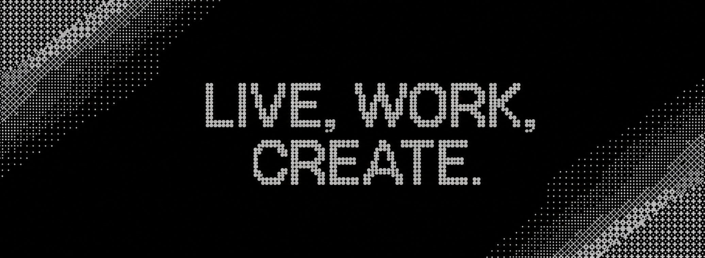

<table width="100%">
  <tr>
    <td align="center" colspan="3">
      

        Hi there! <strong>I'm KOUSHIK G</strong>, a Frontend Developer with hands-on experience in
        
        &nbsp;
        
        &nbsp;
        
        &nbsp;
        
        and React Native. I focus on building responsive, user-centric applications and enjoy exploring modern technologies, improving development practices, and turning ideas into useful digital products.
      

    </td>
  </tr>
  <tr>
    <td align="center" width="36%">
      
    </td>
    <td align="center" width="38%">
      
    </td>
    <td align="center" width="26%">
      <h4>Contact Me</h4>
      
       
       
      
       
       
      
    </td>
  </tr>
  <tr>
    <td align="center" colspan="3">
      
    </td>
  </tr>
  <tr>
    <td align="center" colspan="3">
      <h5>Feel free to explore my projects in my repositories</h5>
      <h5>Let's build something awesome together!</h5>
    </td>
  </tr>
</table>

