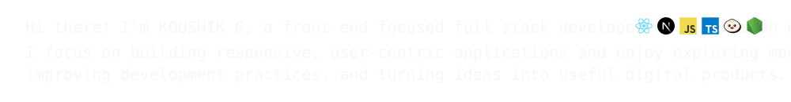
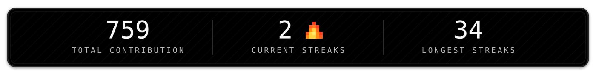

  
  

  

<!-- 
  -->

  <!--  -->
  
  &nbsp;&nbsp;&nbsp;&nbsp;
  
  &nbsp;&nbsp;&nbsp;&nbsp;
  
  &nbsp;&nbsp;&nbsp;&nbsp;
  <a href="https://drive.google.com/file/d/120WhbNoPKWCE-HyQ0XKjZmsgQfS6gZzy/view?usp=sharing" target="_blank" style="text-decoration: none;">
  <!-- &nbsp;View Resume -->
  </a>

